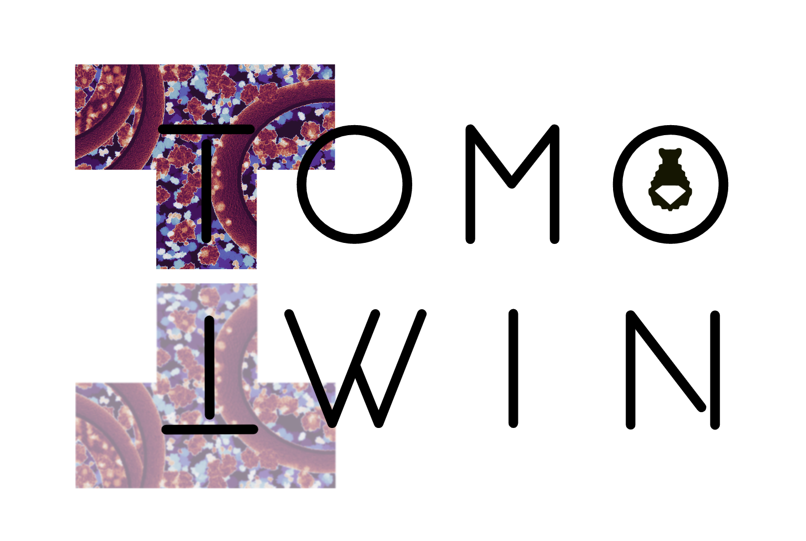

**The development version of the code can be found in the dev branch. A streamlined version including instructions how to use it will follow soon.**

# TomoTwin

Particle picking in Tomograms using triplet networks and metric learning

