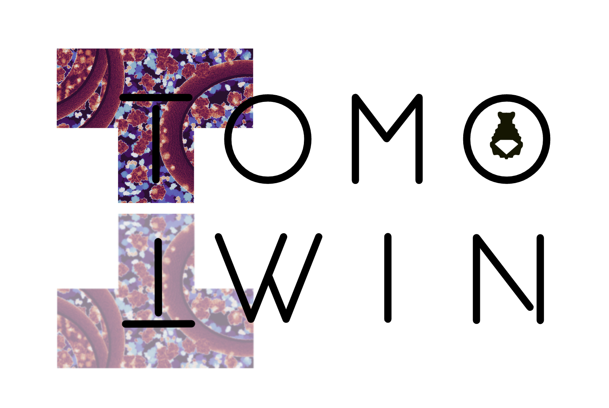

Welcome to TomoTwin's User Guide!
==================================

Welcome, this is the user guide for TomoTwin - a deep metric learning based particle picking procedure for cryo-ET.

In comparision with other tools, TomoTwin comes pre-trained on so far 120 different proteins. By embedding tomograms in an information-rich, high-dimensional space which separates macromolecules according to their 3-dimensional structure, TomoTwin allows users to identify proteins in tomograms de novo without manually creating training data or retraining the network each time a new protein is to be located. That means, you can simply run it for your specific sample without a much additional effort.

TomoTwin provides you two workflows to get your particle picked:

The **reference based workflow** ....

The **clustering workflow** ...

All that said, TomoTwin is still in an early stage and there is certainly a lot of room for improvements. New models will soon improve the localization of soluable proteins even further. Future work migh bring support for filaments and membrane proteins as well. So bare with us - we keep you posted  :-)

User Guide: full table of contents
==================================

.. toctree::
   :maxdepth: 2

   installation
   tutorials/tutorials_overview