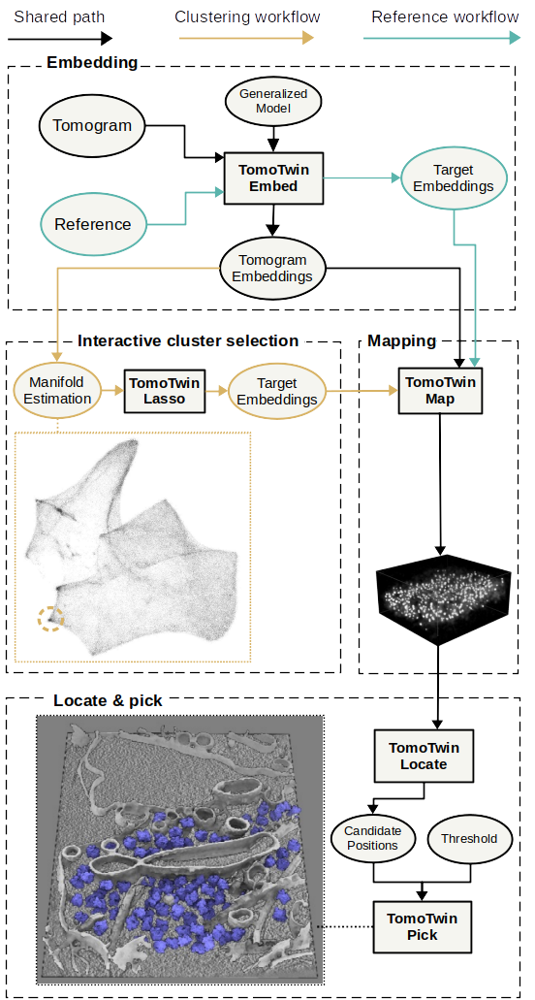

Welcome to TomoTwin's User Guide!
==================================

Welcome, this is the user guide for TomoTwin - a deep metric learning based particle picking procedure for cryo-ET.

In comparision with other tools, TomoTwin comes pre-trained on so far 120 different proteins. By embedding tomograms in an information-rich, high-dimensional space which separates macromolecules according to their 3-dimensional structure, TomoTwin allows users to identify proteins in tomograms de novo without manually creating training data or retraining the network each time a new protein is to be located. That means, you can simply run it for your specific sample without a much additional effort.

TomoTwin provides you two workflows to get your particles picked:

In the **reference based workflow** a single molecule is picked for each protein of interest and used as a target to localize other instances of the protein. We provide a :ref:`step-by-step tutorial <tutorial-reference>` to make it easy for you to run it on your own dataset.

The **clustering workflow**  where macromolecular structures of interest are identified on a 2D manifold. The is approach is still under active development to streamline it as much as possible for you. We will provide a tutorial soon.

All that said, TomoTwin is still in an early stage and there is certainly a lot of room for improvements. New models will soon improve the localization of soluable proteins even further. Future work might bring support for filaments and membrane proteins as well. So bare with us - we keep you posted  :-)

User Guide: full table of contents
==================================

.. toctree::
   :maxdepth: 2

   installation
   tutorials/tutorials_overview
   changes

Help
====

Any questions? Problems? Suggestions?

Find help at our `mailing list <https://listserv.gwdg.de/mailman/listinfo/sphire>`_ or `open an issue on GitHub <https://github.com/MPI-Dortmund/tomotwin-cryoet/issues>`_!