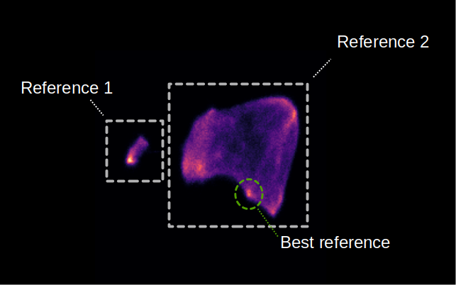

Strategy 1: Refinement of references/targets using umaps
========================================================

When to use it
--------------

You have selected references or cluster targets, but you are not satisfied with the picking results. The embedding computed from a cluster or reference is not always an ideal representation. Some references just don't work well, and sometimes umap doesn't show all the structure that is actually in the umap embedding.

What it does
------------

This strategy takes your references/targets and collects all embeddings that are slightly similar to at least one of your references/targets (similarity > 0.5). These embeddings are then used to estimate a UMAP.

   Umap embeddings that have a slight similarity to two manually selected references. Both references either had too many false positives or false negatives. After selecting the cluster highlighted in green, the selection became much more precise.

In some cases, you will see new structures in the umap, where some of these new structures of the umap correspond to irrelevant embeddings (e.g. membranes). By finding the cluster in the umap that actually corresponds to your target protein, you can improve the picking!

How to use it
-------------

I assume you ran the reference workflow in this example. But it can easily be used with cluster target embeddings as well.

1. Filter the tomogram embeddings
^^^^^^^^^^^^^^^^^^^^^^^^^^^^^^^^^

We first select those embeddings that are reasonably close (`-t 0.5`) to our reference embeddings.

 .. prompt:: bash $

    tomotwin_tools.py filter_embedding -i embed/tomo_embeddings.temb -m map/map.tmap -t 0.5 -o filter/ --lower --concat

2. Estimate umap
^^^^^^^^^^^^^^^^

 .. prompt:: bash $

    tomotwin_tools.py umap -i filter/tomo_embeddings_filtered_allrefs.temb -o umap/

3. Start napari and select regions of interest
^^^^^^^^^^^^^^^^^^^^^^^^^^^^^^^^^^^^^^^^^^^^^^

To start napari run:

 .. prompt:: bash $

    napari tomo/tomo.mrc umap/tomo_embeddings_filtered_allrefs_label_mask.mrci

After starting napari, load the clustering plugin: :guilabel:`Plugins` -> :guilabel:`napari-tomotwin` -> :guilabel:`Cluster umap embeddings`.

Within the plugin, select the :file:`.tumap` file in the :file:`umap/` folder and press :guilabel:`load`.

Select your targets in the umap. You can select multiple targets by pressing :kbd:`Shift`. Save your targets when you are done. I assume you saved them in `cluster_targets/`.

4. Map the cluster targets with the tomogram embeddings
^^^^^^^^^^^^^^^^^^^^^^^^^^^^^^^^^^^^^^^^^^^^^^^^^^^^^^^

 .. prompt:: bash $

    tomotwin_map.py distance -r cluster_targets/cluster_targets.temb -v embed/tomo_embeddings.temb -o map_cluster/

5. Locate the particles
^^^^^^^^^^^^^^^^^^^^^^^

 .. prompt:: bash $

    tomotwin_locate.py findmax -m map_cluster/map.tmap -o locate_refined/

Check your results with the napari-boxmanager :-)
