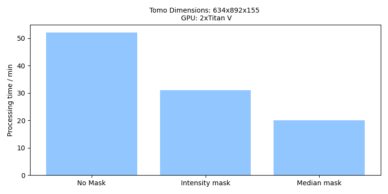

Strategy 2: Speedup and improvement of embeddings using median filtering
========================================================================

When to use it
--------------

You may use this strategy for two reasons:

 1. It makes the embedding step much faster. So you might just want to save time.
 2. It skips a large part of the empty areas of the tomogram, which can improve the umap.

What it does
------------

The command used in the strategy creates a mask. This mask defines a ROI within the tomogram and excludes areas that are most likely not of interest.

It takes advantage of the fact that the average position within a tomogram is unlikely to contain a centered protein. Thus, if a sample of some positions within the tomogram is taken, the median of these embeddings is likely to be a good representation of the background embedding.

The command first calculates the embeddings of a tomogram using a large stride (coarse sampling). It then calculates the median embedding from the coarse tomogram embeddings. Using the median embedding, we can calculate a heatmap of how likely it is that a given position is a background embedding. From this heatmap, a mask is generated using only those positions that are highly dissimilar to the median embedding.

   Mask for a Tomogram using the default parameters of the median mask command.

This mask can then be used to compute the embeddings with a smaller stride (fine sampling). But using the mask effectively reduces the total number of embeddings and makes the embedding faster, which is the first advantage of this strategy.

   Comparison of processing time using no mask, a mask based on intensity heuristics, and a mask based on the median embedding. All results were calculated using TomoTwin 0.7.

In addition, and this is the second advantage, fewer background embeddings also means that the umap can focus on those embeddings that are actually more important, which may yield more protein clusters.

How to use it
-------------

1. Estimate the mask
^^^^^^^^^^^^^^^^^^^^

To calculate the mask, all you need is your tomogram and the latest TomoTwin model:

 .. prompt:: bash $

    CUDA_VISIBLE_DEVICES=0,1 tomotwin_tools.py embedding_mask median -i tomo/tomo.mrc -m tomotwin_latest.pth -o mask

2. Calculate the (filtered) embeddings
^^^^^^^^^^^^^^^^^^^^^^^^^^^^^^^^^^^^^^

 .. prompt:: bash $

    CUDA_VISIBLE_DEVICES=0,1 tomotwin_embed.py tomogram -v tomo/tomo.mrc -m tomotwin_latest.pth --mask mask/tomo_mask.mrc

Once the embeddings are computed, you can simply continue with either the reference or clustering workflow.
