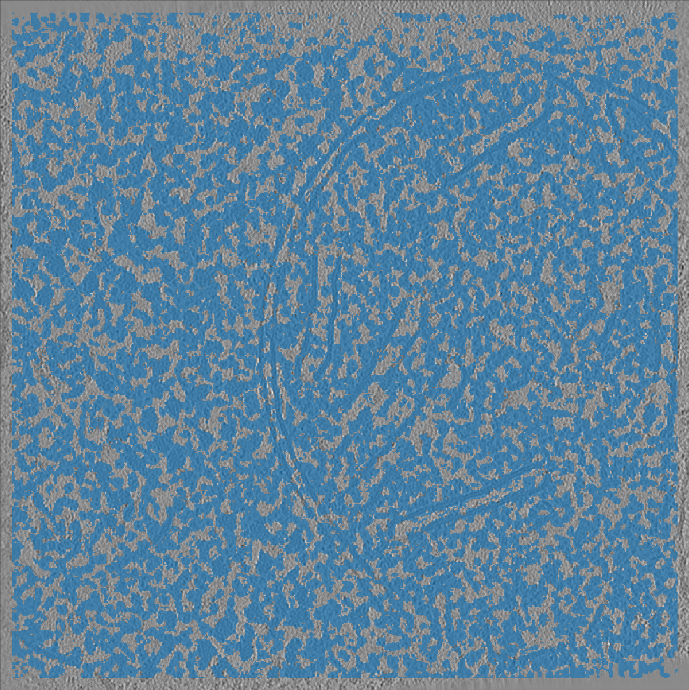

Strategy 3: Filtering tomogram embeddings based on the median embedding
========================================================

When to use it
--------------

You didn't use masking for your tomogram embedding and are having a hard time finding your proteins in the UMAP. Or you just want to speed things up.

What it does
------------

This strategy takes the embeddings from a whole tomogram, calculates the median embedding, and removes any embeddings with a high similarity to the median.

   Filtered embeddings created using the default application of this strategy. Total embedding size reduced by 58%.

Note that this strategy is redundant with strategy #1. If you already performed masking during your embeddings do not use this strategy.

If instead you embedded the entire tomogram, this strategy will typically removes background embeddings which speeds up later steps and improves the UMAP interpretability.

How to use it
-------------

1. Calculate the median embedding
^^^^^^^^^^^^^^^^^^^^^^^^^^^^^^^^^

We first calculate the median of the tomogram embeddings.

 .. prompt:: bash $

    tomotwin_tools.py median_embedding -i embed/tomo_embeddings.temb -o median_embedding/

2. Calculate the distance map from the median
^^^^^^^^^^^^^^^^^^^^^^^^^^^^^^^^^

Next we map the distance between the median embedding and the rest of the tomogram embeddings.

 .. prompt:: bash $

    tomotwin_map.py distance -r median_embedding/embed_med.temb -v embed/tomo_embeddings.temb -o map_median/

3. Filter the tomogram embeddings
^^^^^^^^^^^^^^^^^^^^^^^^^^^^^^^^^

Next we filter the tomogram embeddings to remove any embeddings reasonably close to the median `(t > 0.5)`.

 .. prompt:: bash $

    tomotwin_tools.py filter_embedding -i embed/tomo_embeddings.temb -m map_median/map.tmap -t 0.5 -o median_filtered/

4. Estimate umap
^^^^^^^^^^^^^^^^

 .. prompt:: bash $

    tomotwin_tools.py umap -i median_filtered/tomo_embeddings_filtered_.temb -o umap/

5. Start napari and select regions of interest
^^^^^^^^^^^^^^^^^^^^^^^^^^^^^^^^^^^^^^^^^^^^^^

To start napari run:

 .. prompt:: bash $

    napari tomo/tomo.mrc umap/tomo_embeddings_filtered_label_mask.mrci

After starting napari, load the clustering plugin: :guilabel:`Plugins` -> :guilabel:`napari-tomotwin` -> :guilabel:`Cluster umap embeddings`.

Within the plugin, select the :file:`.tumap` file in the :file:`umap/` folder and press :guilabel:`load`.

Select your targets in the umap. You can select multiple targets by pressing :kbd:`Shift`. Save your targets when you are done. I assume you saved them in `cluster_targets/`.

6. Map the cluster targets with the tomogram embeddings
^^^^^^^^^^^^^^^^^^^^^^^^^^^^^^^^^^^^^^^^^^^^^^^^^^^^^^^

 .. prompt:: bash $

    tomotwin_map.py distance -r cluster_targets/cluster_targets.temb -v embed/tomo_embeddings.temb -o map_cluster/

7. Locate the particles
^^^^^^^^^^^^^^^^^^^^^^^

 .. prompt:: bash $

    tomotwin_locate.py findmax -m map_cluster/map.tmap -o locate_refined/

Check your results with the napari-boxmanager :-)
