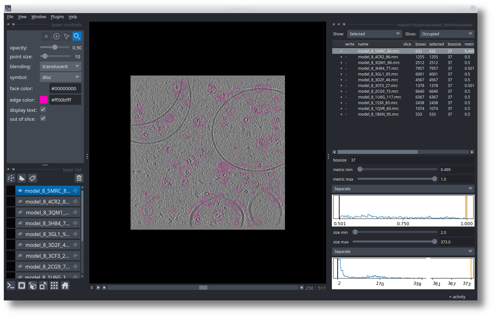

.. _tutorial-reference:

Tutorial 1: Reference based particle picking
============================================

In this tutorial we describe how to use TomoTwin for picking in tomograms using references.

 .. note::

    **Example Dataset**

    To check if everything is working you can use our demo for `EMPIAR 10499 <https://www.ebi.ac.uk/empiar/EMPIAR-10499/>`_. As for this demo the pixel size is already reasonable, you can skip step 1 of the tutorial. The folder :file:`reference_output` contains the results when we run it locally. The file :file:`run.sh` contains all commands we run. The total runtime was ~ 30 minutes on 2 x A100 GPUs.

    Download: `https <https://ftp.gwdg.de/pub/misc/sphire/TomoTwin/data/reference_picking/example_reference_picking.tar.gz>`_

1. Downscale your Tomogram to 10 Å
^^^^^^^^^^^^^^^^^^^^^^^^^^^^^^^^^^^

.. include:: text_modules/downscale_reference.rst

2. Pick and extract your reference
^^^^^^^^^^^^^^^^^^^^^^^^^^^^^^^^^^^

For the reference based approach you need, of course, references. To pick them follow the next steps:

1. Open your tomogram in napari

 .. note::

    For easy identification of your reference particle we recommend to use low-pass filter to 60Å and/or denoising (be sure it has the same pixel size of the tomogram you will pick on).

 .. prompt:: bash $

    napari_boxmanager your_tomo_a10.mrc

2. Select :guilabel:`organize_layer` tab of the boxmanager toolkit (lower right corner). Press the button :guilabel:`Create particle layer`.

3. Switch to the :guilabel:`boxmanager` tab and set the :guilabel:`boxsize` to 37, as this gonna be the box size we will use for extraction later on.

4. Identify a potential reference, choose the slice so that its centered and pick it by clicking in the center of the particle. Continue doing that until you think you have enough references

 .. note::

    **Use multiple references per particle class**

    We recommend to pick multiple (3-4) references per protein of interest, as not all subvolumes work equally well.

    Each reference can be later evaluated separately using the boxmanager, allowing you to decide which gives the best result for each protein of interest

5. Optional: If you want to pick another protein class, we recommend to create a separate particle layer for it (step 2).

6. To save the reference of the selected particle layer (see layer list in napari), click on :guilabel:`File` -> :guilabel:`Save Selected Layer(s)`. Create a new folder by right click in the dialog and name it for example 'coords'. Now select as :guilabel:`Files of type` the entry :guilabel:`Box Manager`. Use the filename `reference.coords` and press :guilabel:`Save`.

7. Finally, use the ``tomotwin_tools.py extractref`` script to extract a subvolume from the tomogram (the original, not the denoised / low pass filtered) at the coordinates for each reference. If there are multiple references you would like to pick in the tomogram, repeat this process multiple times giving a new output folder each time.

 .. prompt:: bash $

    tomotwin_tools.py extractref --tomo tomo/your_tomo_a10.mrc --coords path/to/references.coords --out reference/ --filename protein_a

You will find your extracted references in `reference/protein_a_X.mrc` where X is a running number.

3. Embed your Tomogram
^^^^^^^^^^^^^^^^^^^^^^

.. include:: text_modules/embed.rst

4. Embed your reference
^^^^^^^^^^^^^^^^^^^^^^^

Now you can embed your reference:

.. prompt:: bash $

    CUDA_VISIBLE_DEVICES=0,1 tomotwin_embed.py subvolumes -m LATEST_TOMOTWIN_MODEL.pth -v reference/*.mrc -b 12 -o out/embed/reference/

.. hint:: **Strategy: Refine your reference using umaps**

    Some references just don’t work well - you can try to refine it using umaps.

    Check out the :ref:`corresponding strategy <strategy-01>`!

5. Map your tomogram
^^^^^^^^^^^^^^^^^^^^

The map command will calculate the pairwise distances/similarity between the references and the subvolumes and generate a localization map:

.. prompt:: bash $

    tomotwin_map.py distance -r out/embed/reference/embeddings.temb -v out/embed/tomo/your_tomo_a10_embeddings.temb -o out/map/

6. Localize potential particles
^^^^^^^^^^^^^^^^^^^^^^^^^^^^^^^

.. include:: text_modules/locate.rst

7. Inspect your particles with the boxmanager
^^^^^^^^^^^^^^^^^^^^^^^^^^^^^^^^^^^^^^^^^^^^^

Open your particles with the following command or drag the files into an open napari window:

.. prompt:: bash $

    napari_boxmanager tomo/your_tomo_a10.mrc out/locate/located.tloc

The example shown here is from the SHREC competition. In the table on the right you see 12 references. I selected the :guilabel:`model_8_5MRC_86.mrc`, which is a ribosome.
Below the table, you need to adjust the :guilabel:`metric min` and :guilabel:`size min` thresholds until you like the results. After the optimization is done the result might look similar to this:

.. image:: ../img/tutorial_1/after_optim.png
   :width: 650

In the left panel, select the references you would like to pick (:kbd:`Control` + :kbd:`LMB`  on linux/windows, :kbd:`CMD` + :kbd:`LMB` on mac to select multiple). You can now press :guilabel:`File` -> :guilabel:`Save selected Layer(s)`. In the dialog, change the :guilabel:`Files of type` to  :guilabel:`Box Manager`. Choose filename like :guilabel:`selected_coords.tloc`. Make sure that the file ending is :file:`.tloc`.

To convert the :file:`.tloc` file into :file:`.coords` you need to run

.. prompt:: bash $

    tomotwin_pick.py -l coords.tloc -o coords/

You will find coordinate file for each reference in :file:`.coords` format in the :file:`coords/` folder.

.. hint:: **Strategy: Improve your picks by refining your references**

    Manual selected references can sometimes be optimized using umaps!

    Check out the :ref:`corresponding strategy <strategy-01>`!

8. Scale your coordinates
^^^^^^^^^^^^^^^^^^^^^^^^^

.. include:: text_modules/scale.rst