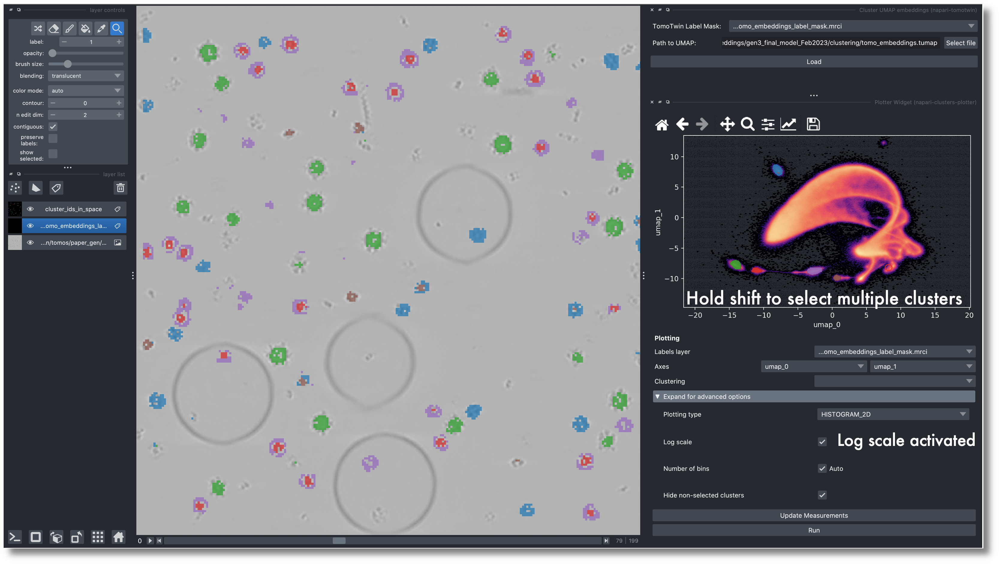
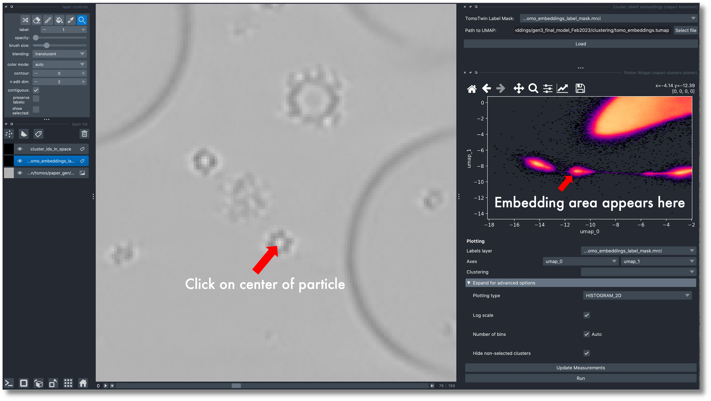
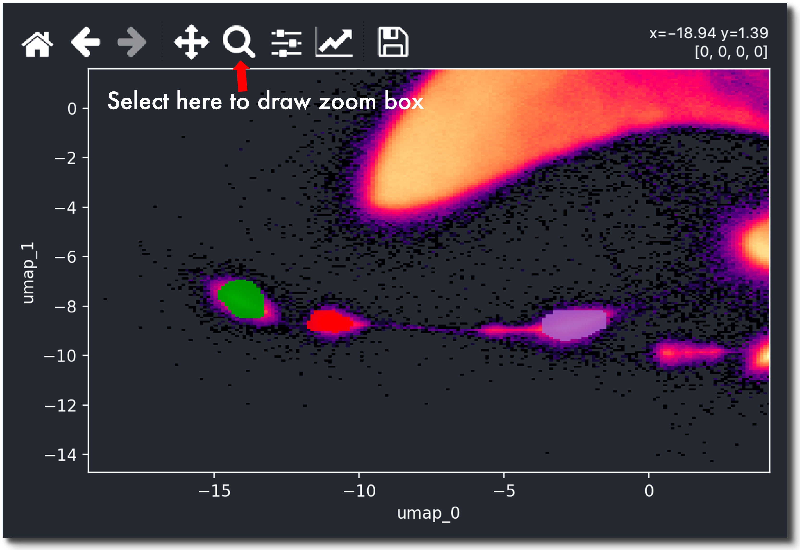

Tutorial 2: Clustering based particle picking
============================================

1. Downscale your Tomogram to 10 Å
^^^^^^^^^^^^^^^^^^^^^^^^^^^^^^^^^^^
.. include:: text_modules/downscale_clustering.rst

2. Embed your Tomogram
^^^^^^^^^^^^^^^^^^^^^^^
.. include:: text_modules/embed.rst

3. Estimate UMAP manifold and Generate Embedding Mask
^^^^^^^^^^^^^^^^^^^^^^^^^^

Now we will approximate the tomogram embeddings to 2D to allow for efficient visualization. To calculate a UMAP:

.. prompt:: bash $

    tomotwin_tools.py umap -i out/embed/tomo/tomo_embeddings.temb -o out/clustering/

.. note::

    If you encounter an out of memory error here, you may need to reduce the :guilabel:`fit_sample_size` and/or :guilabel:`chunk_size` values (default 400,000).

Additionally, it generated a mask (`tomo_embeddings_label_mask.mrci`) of the embeddings to allow us to track which UMAP values correspond to which points in the tomogram.

4. Load data for clustering in Napari
^^^^^^^^^^^^^^^^^^^^^^^^

Now that we have all the input files for the clustering workflow we can get started in Napari. First open your tomogram and the embedding mask by:

.. prompt:: bash $

    napari your_tomo_a10.mrc out/clustering/your_tomo_a10_embedding_label_mask.mrci

Next open the napari-tomotwin clustering tool via :guilabel:`Plugins` -> :guilabel:`napari-tomotwin` -> :guilabel:`Cluster UMAP embeddings`. Then choose the :guilabel:`Path to UMAP` by clicking on :guilabel:`Select file` and provide the path to your :file:`your_tomo_a10_embeddings.tumap`. 
Click :guilabel:`Load` and after a second, a 2D plot of the umap embeddings should appear in the plugin window.

5. Find target clusters
^^^^^^^^^^^^^^^^^^^^^^^^

The next step is to generate potential targets from the 2D umap using the interactive lasso (freehand) tool from the napari-clusters-plotter.

.. admonition:: **Check out the video demo of selecting clusters**

    ..  youtube:: PaJlaPAfqtI
       :align: center

Outline a set of points in the 2D plot and these points will become highlighted in your tomogram. To select multiple targets at once hold :kbd:`Shift` when outlining points.

.. admonition:: **Use log scale to see weak clusters**
    
    When the abundance of the protein is low, the clusters are often difficult to detect. Using a log scale for the plot may show clusters that are otherwise difficult to spot. To activate the log scale click on :guilabel:`Advanced settings` :guilabel:`Log scale`.

Alternatively you can click in the tomogram and a small red circle appears around the embedding for this position in the tomogram.

You can use the |mag| icon to change the displayed area/zoom and the :guilabel:`Home` icon to reset it.

.. admonition:: **Improved centering**

    When generating targets to pick large proteins, it is best to outline points that only lay in the center of your protein rather than covering the entire protein. Note that due to the way embeddings are generated from the tomogram, this likely won't be in the center of the cluster. This will help ensure that your resulting picks are centered.

    .. image:: ../img/tutorial_2/img4.png
        :width: 650
        :align: center

6. Save target clusters
^^^^^^^^^^^^^^^^^^^^^^^^

Once you have outlined a target cluster for each protein of interest, it is time to save these targets to be used as picking references in this and additional tomograms.

This can be done with :guilabel:`Plugins` -> :guilabel:`napari-tomotwin` -> :guilabel:`Save cluster targets` and providing an output directory :file:`cluster_targets.temb` will be written.

7. Map your tomogram
^^^^^^^^^^^^^^^^^^^^

The map command will calculate the pairwise distances/similarity between the targets and the tomogram subvolumes and generate a localization map:

.. prompt:: bash $

    tomotwin_map.py distance -r out/clustering/cluster_targets.temb -v out/embed/tomo/your_tomo_a10_embeddings.temb -o out/map/

8. Localize potential particles
^^^^^^^^^^^^^^^^^^^^^^^^^^^^^^^

.. include:: text_modules/locate.rst

Open your particles with the following command or drag the files into an open napari window:

.. prompt:: bash $

    napari_boxmanager tomo/your_tomo_a10.mrc out/locate/located.tloc

.. image:: ../img/tutorial_1/start.png
   :width: 650

The example shown here is from the SHREC competition. In the table on the right you see 12 references. I selected the :guilabel:`model_8_5MRC_86.mrc`, which is a ribosome.
Below the table, you need to adjust the :guilabel:`metric min` and :guilabel:`size min` thresholds until you like the results. After the optimization is done the result might look similar to this:

.. image:: ../img/tutorial_1/after_optim.png
   :width: 650

In the left panel, select the references you would like to pick (:kbd:`Control` + :kbd:`LMB` on linux/windows, :kbd:`CMD` + :kbd:`LMB` on mac to select multiple). You can now press :guilabel:`File` -> :guilabel:`Save selected Layer(s)`. In the dialog, change the :guilabel:`Files of type` to  :guilabel:`Box Manager`. Choose filename like :guilabel:`selected_coords.tloc`. Make sure that the file ending is :file:`.tloc`.

.. hint:: **Strategy: Improve your picks by refining your cluster targets**

    Cluster targets can sometimes be optimized using umaps!

    Check out the :ref:`corresponding strategy <strategy-01>`!

To convert the :file:`.tloc` file into :file:`.coords` you need to run

.. prompt:: bash $

    tomotwin_pick.py -l coords.tloc -o coords/

You will find coordinate file for each reference in :file:`.coords` format in the :file:`coords/` folder.

9. Scale your coordinates
^^^^^^^^^^^^^^^^^^^^^^^^^

.. include:: text_modules/scale.rst

