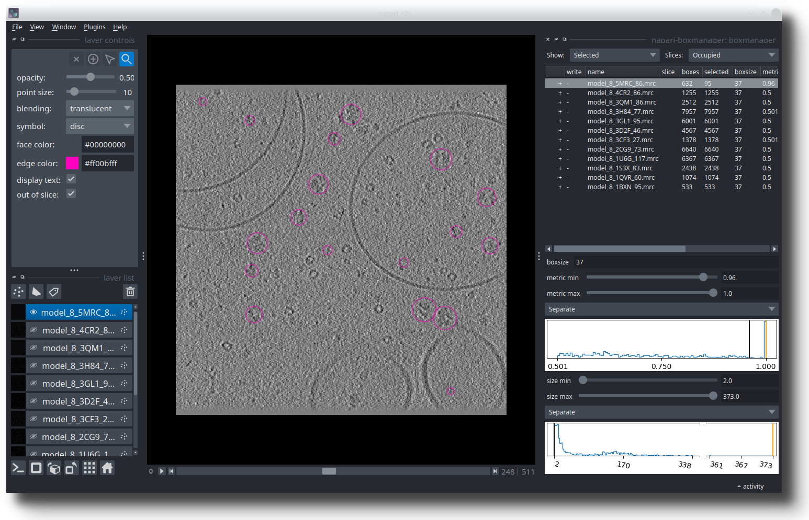

Tutorial 2: Clustering based particle picking
============================================

1. Rescale your Tomogram
---------------------------------

.. include:: text_modules/downscale_clustering.rst

2. Embed your Tomogram
----------------------

.. include:: text_modules/embed.rst

3. Estimate UMAP manifold and Generate Embedding Mask
-----------------------------------------------------

Now we will approximate the tomogram embeddings to 2D to allow for efficient visualization. To calculate a UMAP:

.. prompt:: bash $

    tomotwin_tools.py umap -i out/embed/tomo/tomo_embeddings.temb -o out/clustering/

.. note::

    If you encounter an out of memory error here, you may need to reduce the :guilabel:`fit_sample_size` and/or :guilabel:`chunk_size` values (default 400,000).

4. Load data for clustering in Napari
-------------------------------------

Now that we have all the input files for the clustering workflow we can get started in Napari. First open your tomogram and the embedding mask by:

.. prompt:: bash $

    napari your_tomo_a10.mrc

Next open the napari-tomotwin clustering tool via :guilabel:`Plugins` -> :guilabel:`TomoTwin clustering workflow`. Then choose the :guilabel:`Path to UMAP` by clicking on :guilabel:`Select file` and provide the path to your :file:`your_tomo_a10_embeddings.tumap`.
Click :guilabel:`Load` and a 2D plot of the umap embeddings should appear in the plugin window. It will do some calculating in the background and might take a few seconds.

5. Find target cluster
----------------------

Once you loaded a umap by the previous step, a set of tools will open.

    GUI for the clustering workflow.

* **Clustering area:** Here you can select clusters within the umap using the lasso (freehand) tool.
* **Plotting parameters:** Only two options are relevant for TomoTwin. The :guilabel:`Layer` combo box allows you to select which UMAP you want to visualize. At the beginning only one UMAP is available. Later in the workflow, more may appear. If you change it, you need to press the :guilabel:`Plot` button to update the UMAP. The second relevant option is the :guilabel:`Log scale` plot. For this you need to expand the :guilabel:`advanced options` and check the :guilabel:`log scale` checkbox.
* **Tools**: Here you will find some helpful tools. First you need to select a cluster from the dropdown box. :guilabel:`Show target` will help you evaluate if a cluster might be a good target. :guilabel:`Recompute UMAP` allows you to refine a selected cluster. Once you have found a good cluster, you can add it to the candidate list with :guilabel:`Add candidate`.
* **Candidates**: Each row represents a candidate target. The labels are label changeable. Left clicking on the table allows to :guilabel:`Show` or the :guilabel:`Delete` a candidate. Sve the candidate targets to disk by pressing :guilabel:`Save candidates`.

.. admonition:: **Use log scale to see weak clusters**

    When the abundance of the protein is low, the clusters are often difficult to detect. Using a log scale for the plot may show clusters that are otherwise difficult to spot. To activate the log scale click on :guilabel:`Advanced settings` :guilabel:`Log scale`.

Locate potential targets
~~~~~~~~~~~~~~~~~~~~~~~~

The next step is to generate potential targets from the 2D umap. We will use a tomogram that shows two distinct particle populations (yellow: Tc toxin, blue: ribosome) as example:

    Tomogram with UMAP inset. Two quite distinct particle populations can be identified. The yellow circle highlights a toxin particle, the blue circle a ribosome particle.

You can use the interactive lasso (freehand) tool from the "napari cluster plotter" to select clusters in the UMAP. When you outline an area in the UMAP, the corresponding area in the tomogram is highlighted.

    Tomogram with UMAP as inset. The selected cluster contains both particle populations.

.. admonition:: **The Anchor tool helps to locate clusters in the UMAP**

    Clicking on the tomogram creates an “anchor” (a little circle) in the UMAP. The anchor can help you to locate a cluster in the UMAP. By holding :kbd:`Shift` you can add multiple anchors.

    .. image:: ../img/tutorial_2/figure_anchor.png
        :width: 450
        :align: center

Refine cluster targets
~~~~~~~~~~~~~~~~~~~~~~

The selection we made is not satisfactory as both the toxins and the ribosomes are selected. TomoTwin uses UMAPs to reduce the 32-dimensional embedding space to a 2-dimensional space that can be visualized. However, this reduction is not perfect and sometimes a cluster can actually contain several sub-clusters. Pressing :guilabel:`Recompute UMAP` will compute a new UMAP for the embeddings contained in the selected cluster.

    Recalculated UMAP for the embeddings contained in the previously selected cluster.

The new umap shows new structure. If we select the rather densely populated area on the left, we have identified the cluster that exclusively represents the toxin cluster. To select the ribosome cluster, we lasso the tip of the larger and fuzzier area by holding :kbd:`Shift` while outlining the area.

    In the recalculated UMAP we can now separate the toxin from the ribosome cluster.

For the ribosome, we could get a more "complete" highlighting if we had selected the entire area. However, the way we did it is preferable because we only get the center of the ribosome, which results in better centered picks.

As a sanity check, we can press :guilabel:`Show target` for each cluster in the dropdown list. In TomoTwin, a cluster is reduced and represented by a single embedding point (the cluster center). It is a good sanity check to visualize which of the points in your cluster represents your cluster. By clicking :guilabel:`Show target`, the center (medoid) is calculated and visualized in the tomogram by a circle in the cluster color. If the circle is roughly centered on your protein of interest, its probably a good target. If the circle is approximately centered on your protein of interest, it is probably a good target. If it is not centered on a target, but rather on background, other structures or contamination, you should continue to refine your cluster target. Here, both cases are centered on the toxin and ribosome, respectively.

Add and save candidates
~~~~~~~~~~~~~~~~~~~~~~

Now that we are satisfied with our selection, we can add both clusters to the candidate list by selecting each cluster in the drop-down list and pressing :guilabel:`Add candidate`.

We recommend that you change the label of each candidate by double-clicking with the left mouse button in one of the label cells.

    All potential targets are listed and labeled candidates table. Right click on a row allow to :guilabel:`Delete` the candidate or by pressing :guilabel:`Show` to restore the UMAP selection.

Finally, we can save the the corresponding labels to disk by pressing :guilabel:`Save candidates`. Select a folder and write the candidate to disk. The folder will contain several files:

- :file:`cluster_targets.temb`: This is the file you will use in the next steps. It contains the medoid embedding for each cluster.
- :file:`embeddings_CLUSTER_LABEL.temb`: One file per cluster. It contains all the embeddings that are part of that cluster.
- :file:`medoid_CLUSTER_LABEL.coords`: The coordinates of the cluster centre (medoid). This is the same as what you get when you click on :guilabel:`Show target`

.. admonition:: **Check out the video demo of selecting clusters**

    ..  youtube:: PaJlaPAfqtI
       :align: center

6. Map your tomogram
--------------------

The map command will calculate the pairwise distances/similarity between the targets and the tomogram subvolumes and generate a localization map:

.. prompt:: bash $

    tomotwin_map.py distance -r out/clustering/cluster_targets.temb -v out/embed/tomo/your_tomo_a10_embeddings.temb -o out/map/

7. Localize potential particles
-------------------------------

.. include:: text_modules/locate.rst

Open your particles with the following command or drag the files into an open napari window:

.. prompt:: bash $

    napari_boxmanager tomo/your_tomo_a10.mrc out/locate/located.tloc

.. image:: ../img/tutorial_1/start.png
   :width: 650

The example shown here is from the SHREC competition. In the table on the right you see 12 references. I selected the :guilabel:`model_8_5MRC_86.mrc`, which is a ribosome.
Below the table, you need to adjust the :guilabel:`metric min` and :guilabel:`size min` thresholds until you like the results. After the optimization is done the result might look similar to this:

In the left panel, select the references you would like to pick (:kbd:`Control` + :kbd:`LMB` on linux/windows, :kbd:`CMD` + :kbd:`LMB` on mac to select multiple). You can now press :guilabel:`File` -> :guilabel:`Save selected Layer(s)`. In the dialog, change the :guilabel:`Files of type` to  :guilabel:`Box Manager`. Choose filename like :guilabel:`selected_coords.tloc`. Make sure that the file ending is :file:`.tloc`.

.. hint:: **Strategy: Improve your picks by refining your cluster targets**

    Cluster targets can sometimes be optimized using umaps!

    Check out the :ref:`corresponding strategy <strategy-01>`!

To convert the :file:`.tloc` file into :file:`.coords` you need to run

.. prompt:: bash $

    tomotwin_pick.py -l coords.tloc -o coords/

You will find coordinate file for each reference in :file:`.coords` format in the :file:`coords/` folder.

8. Scale your coordinates
-------------------------

.. include:: text_modules/scale.rst

